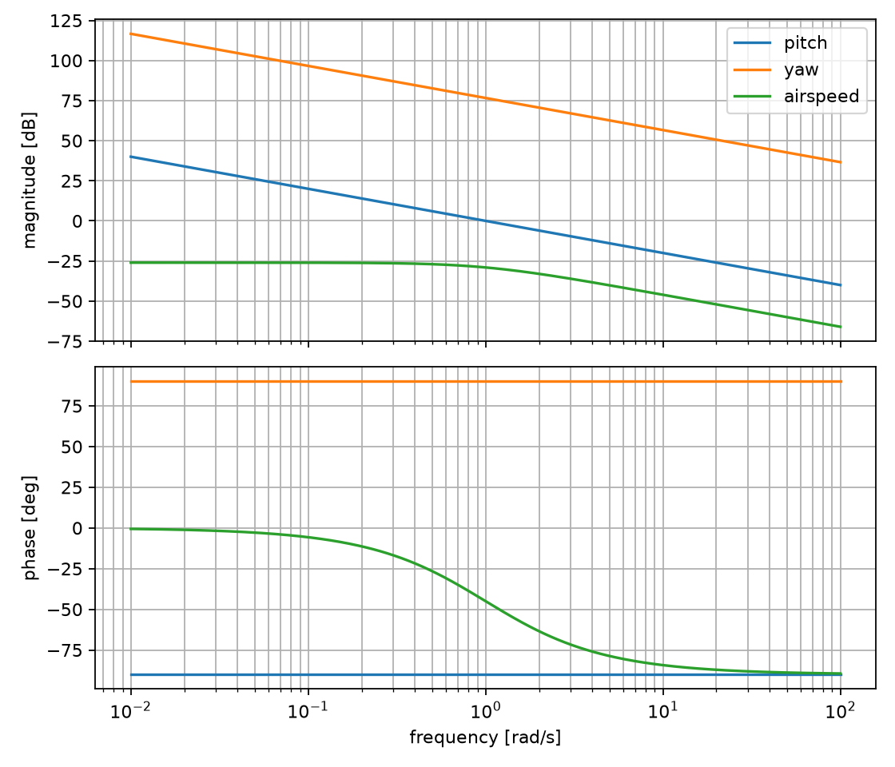

<!-- This file is auto-generated by gen_readme.py -->
# Control Allocation First Approach


This approach is intentionally simple: it groups the eight motors into four
quadrants instead of allocating against each motor independently. That is the
first useful approximation because it makes the mapping from pitch torque, yaw
torque, and total thrust to motor commands easy to inspect by hand. The allocator
turns each command into rotor-speed contributions and sums those commanded rotor
speeds per quadrant, while the simulator still applies the per-motor geometry to
predict the resulting rates and airspeed.

The tradeoff is that the allocator has deliberately hidden some reality. Paired
motors are treated as one actuator group, so individual motor authority,
asymmetric limits, and motor failures are not first-class concepts yet. That is
why approach two removes the quadrant shortcut and exposes every motor as its own
allocation variable.

## Building blocks

At the highest level, each motor contributes torque from a moment arm crossed
with its thrust force.
```math
\boldsymbol{\tau_i} = \mathbf{r_i} \times \mathbf{F_i}
```
The total thrust is the sum of all motor thrusts.
```math
T = \sum_{i=0}^{7} F_{i}
```
Each propeller is modeled with the usual quadratic thrust relationship, then collapsed into a single coefficient used by the generated code.
```math
\mathbf{F_i} = C_{T} D^{4} \rho n_{i}^{2}
```
```math
\mathbf{F_i} = C n_{i}^{2}
```

## SymPy source of truth

The generator scripts keep the math symbolic first. The rigid-body model builds
symbolic torque and thrust equations, then the generation steps substitute the
shared geometry constants from `common.geometry` before printing Python or LaTeX.
```python
from common.geometry import MOTOR_R_Y, MOTOR_R_Z
from common.model import rigid_body_motion

tau_y, tau_z, thrust = rigid_body_motion()
# gen_sim.py substitutes MOTOR_R_Y and MOTOR_R_Z into these symbolic equations.
```
The generated simulator uses these symbolic equations for pitch rate, yaw rate, and airspeed.
```math
\dot{q} = f_{0} r_{z0} + f_{1} r_{z1} + f_{2} r_{z2} + f_{3} r_{z3} + f_{4} r_{z4} + f_{5} r_{z5} + f_{6} r_{z6} + f_{7} r_{z7}
```
```math
\dot{r} = - f_{0} r_{y0} - f_{1} r_{y1} - f_{2} r_{y2} - f_{3} r_{y3} - f_{4} r_{y4} - f_{5} r_{y5} - f_{6} r_{y6} - f_{7} r_{y7}
```
```math
T = f_{0} + f_{1} + f_{2} + f_{3} + f_{4} + f_{5} + f_{6} + f_{7}
```

## Allocation flow

The allocator starts by splitting thrust between the negative-`r_z` and
positive-`r_z` motor rows so a pure thrust request does not accidentally create a
pitch torque. It then adds signed speed deltas for yaw torque by quadrant. Each
quadrant arm is the average position of its two motors. This is a design choice:
it makes the first allocator small and readable, but it assumes the two motors in
a quadrant can be commanded as a pair. Shared quadrant geometry constants are
substituted during generation so runtime callers only pass the three commands
and `C`.
```python
w = allocated_motor_speeds(tau_y, tau_z, thrust, C, r_quadrant_y, r_quadrant_z)
# gen_allocate.py substitutes ALLOCATION_R_QUADRANT_Y/Z before writing allocate.py.
```

## Example expanded equations

After substituting the current approach-one motor geometry, the compact vector
math expands into concrete linear combinations of motor thrusts. These expanded
forms are what the generated simulator ultimately evaluates.
```math
\tau_{y} = - 0.9 f_{0} - 0.9 f_{1} - 0.9 f_{2} - 0.9 f_{3} + 1.1 f_{4} + 1.1 f_{5} + 1.1 f_{6} + 1.1 f_{7}
```
```math
\tau_{z} = 1.5 f_{0} + 0.8 f_{1} - 1.5 f_{2} - 0.8 f_{3} + 1.5 f_{4} + 0.8 f_{5} - 1.5 f_{6} - 0.8 f_{7}
```

## Continuous-time analysis of the generated loop

The continuous-time view is computed from the runnable approach-one stack rather
than from a separate hand model. `approachone.continuous.analyze()` linearizes the
actual `allocate -> sim` path about the hover trim, then wraps that local plant in
a compact state-space model for Bode, controllability, stability, robustness, and
observability discussion. The trim command and state are:
```python
trim_command = (0.0, 0.0, 100.0)
trim_state = (0.0, 0.0, 10.0)
trim_motor_speeds = (3.7081, 3.7081, 3.7081, 3.7081, 3.3541, 3.3541, 3.3541, 3.3541)
```
The local command-to-output gain matrix uses continuous units for pitch and yaw rows and static gain for airspeed.
|  | tau_y | tau_z | T |
| --- | --- | --- | --- |
| pitch rate q | 1 | 7.105e-10 | 1.776e-10 |
| yaw rate r | -1.776e-10 | -6774 | -8.882e-11 |
| airspeed u | 0 | -8.882e-11 | 0.05 |

For classical Bode intuition, the diagonal channels reduce to these local transfer functions:

| channel | local transfer function |
| --- | --- |
| pitch | `1 / s` |
| yaw | `-6.77e+03 / s` |
| airspeed | `0.05 / (s + 1)` |




The corresponding state-space plant uses the rate axes as integrators and models
the airspeed channel as a first-order lag with the static thrust-to-airspeed gain
reported above. With the documented sign-aware diagonal proportional gains, the
closed-loop eigenvalues are `(-1.0, -6.7738, -1.5)`, so the local verdict is **stable for the documented diagonal proportional gains**.

Controllability and observability are both full rank for this three-state local
model: controllability rank `3` and observability
rank `3`. That means the abstract pitch, yaw, and
airspeed channels can be independently moved and seen near the trim point. It
does **not** mean approach one is robust to hardware failures; the quadrant
allocator has already hidden the individual motor degrees of freedom.

Robustness notes from the analysis:

- The hover linearization is nearly diagonal: each high-level command primarily moves its matching output.
- Yaw allocation uses sqrt(abs(tau_z)), so the exact derivative at zero yaw command is singular; the table reports a small-signal finite-difference slope.
- The allocator hides individual motors, so this analysis cannot certify motor-out robustness.
- Bode margins are meaningful per channel near hover, but saturation and square-root clipping are outside the linear model.


The important limitation is the yaw nonlinearity: approach one commands signed
`sqrt(abs(tau_z))` deltas, so the exact derivative at zero yaw command is not a
well-behaved linear slope. The generated table therefore reports a small
finite-difference slope for stack-level documentation, while later approaches
replace this shortcut with allocation matrices that are better suited to formal
controllability and robustness analysis.

## Why this is not enough

This version is valuable because every step is visible: thrust and pitch are
balanced across the two `r_z` rows, yaw adds signed quadrant corrections, and the
simulator shows the resulting motion. But the simplicity comes from a hand
grouping that throws away per-motor freedom. It cannot naturally ask what
happens when one motor fails, whether one motor should work harder than its
neighbor, or whether a redundant set of motors is being used optimally. Approach
two keeps the same command interface but replaces the quadrant rule with a
geometry-derived matrix that has one column per motor.
