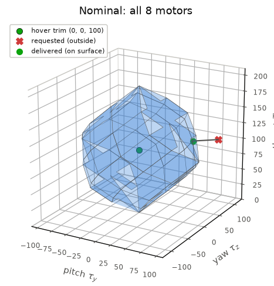
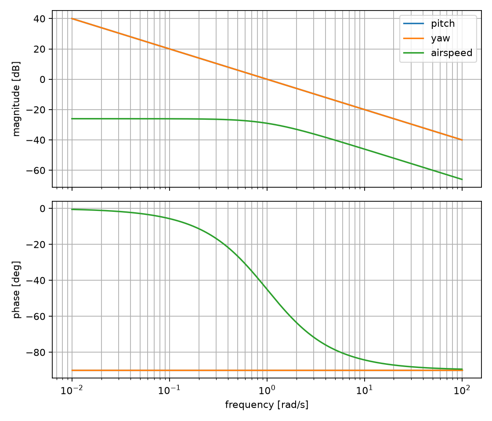
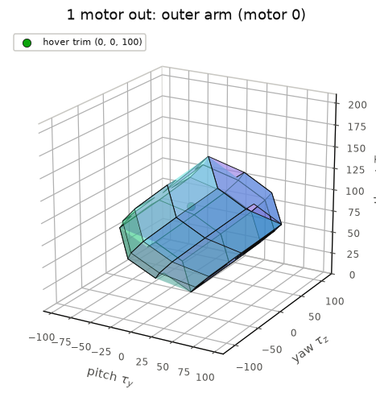
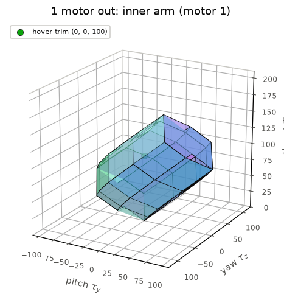
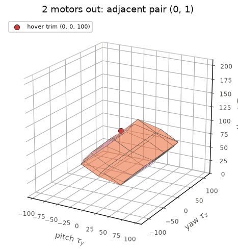
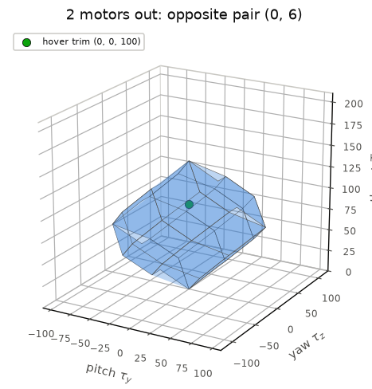
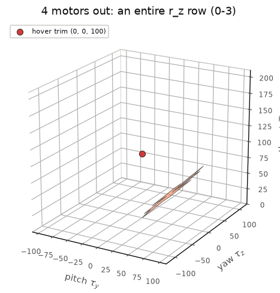

<!-- This file is auto-generated by gen_readme.py -->
# Control Allocation Third Approach


Approaches one and two both allocate as if the motors could spin arbitrarily
fast. They solve an unconstrained problem and only clamp the final square root so
a caller never receives an imaginary speed. That clamp hides the moment when a
motor would have to exceed its physical limit, and it silently distorts the
commanded torque.

Approach three keeps the exact same command interface -- pitch torque, yaw
torque and total thrust -- but makes the per-motor **saturation limits** part of
the problem. This is the point where allocation stops being only an algebraic
inverse and becomes a question about the set of commands the hardware can
actually produce.

That set is a **polytope** in the three-axis command space, and allocation
becomes a small **quadratic program (QP)** that projects the desired command onto
that polytope. A request inside the polytope is delivered exactly; a request
outside it is met by the closest command the motors can produce. Because the
polytope is an explicit object we can also ask whether the vehicle is still
**controllable** after one or more motors fail.

## Building blocks

Each motor uses the same quadratic propeller model as the earlier approaches, so
we allocate in squared-speed space ``s_i = n_i^2``.
```math
F_{i} = C n_{i}^{2}
```
Torque comes from the same SymPy cross product the generated simulator uses, so the documentation and the flight code never disagree.
```math
\tau_{i} = \left[\begin{matrix}0\\f_{i} r_{z_i}\\- f_{i} r_{y_i}\end{matrix}\right]
```
Stacking pitch torque, yaw torque and thrust over all motors gives the linear allocation map. Working in squared-speed space keeps it exactly linear, so the command vector is a matrix product.
```math
u = A s
```
With the current shared geometry the allocation matrix is:
```math
A = \left[\begin{matrix}-0.9 & -0.9 & -0.9 & -0.9 & 1.1 & 1.1 & 1.1 & 1.1\\1.5 & 0.8 & -1.5 & -0.8 & 1.5 & 0.8 & -1.5 & -0.8\\1 & 1 & 1 & 1 & 1 & 1 & 1 & 1\end{matrix}\right]
```

## Saturation makes the problem a polytope

A real motor cannot spin backwards and cannot exceed its top speed, so every
squared speed is boxed:
```math
0 \le s_i \le s_{\max}, \qquad s_{\max} = 25
```
That box is a set in 8-D squared-speed space. Its image under the allocation matrix is the set of every command the motors can actually produce -- the **attainable command set**. Because a linear image of a box is a zonotope, this set is a bounded convex polytope living in the full $(\tau_y, \tau_z, T)$ command space:
```math
\mathcal{A} = \{\, A\,s \;:\; 0 \le s \le s_{\max} \,\} \subset \mathbb{R}^3
```
Its faces and volume are computed straight from the motor generators ``g_k = s_max * A[:, k]`` by `approachthree.model`, the same code the allocator trusts. With all eight motors it has 36 faces and a volume of 2,650,000. The green point is the hover trim; the red request below sits outside the set, so the allocator delivers the nearest point on the surface with motors driven to saturation:




## Allocation is a quadratic program

Rather than invert the allocation matrix and hope the answer is feasible, the
allocator solves for the squared speeds directly as a bound-constrained
least-squares problem: get as close to the commanded ``u`` as possible while
staying inside the box.
```math
\begin{aligned}\min_{s}\ & \tfrac{1}{2}\,\lVert A s - u \rVert_W^{2} + \tfrac{\lambda}{2}\,\lVert s \rVert^{2} \\\text{s.t.}\ & 0 \le s \le s_{\max}\end{aligned}
```
The weight matrix $W$ weights pitch and yaw far above thrust, so when the vehicle saturates **thrust is sacrificed first**: attitude control is held as a safety priority even at the cost of losing altitude or airspeed. The ratio is large enough that the moments are held essentially exactly and the whole shortfall is taken out of thrust. The effort weight $\lambda$ is `1e-06` -- the same role approach two's damping plays, keeping the solution unique and the problem strictly convex.
```math
W = \left[\begin{matrix}1000 & 0 & 0\\0 & 1000 & 0\\0 & 0 & 1\end{matrix}\right]
```
Expanding the norms turns this into a standard convex QP with a positive definite Hessian, whose optimum is the projection of $u$ onto the polytope $\mathcal{A}$:
```math
\min_{s}\ \tfrac{1}{2}\, s^{\top} H s + c^{\top} s \quad\text{s.t.}\ 0 \le s \le s_{\max}, \qquad H = A^{\top} W A + \lambda I,\ \ c = -A^{\top} W u
```

## Solving the QP ourselves

In the spirit of approach two assembling its own pseudoinverse, we do not call a
QP library. The optimum is found with a primal **active-set** iteration: motors
that want to leave the feasible box are pinned to a bound, the remaining free
motors are driven to the equality-constrained minimum, and a bound is released
only when its KKT multiplier proves the cost can still fall. Because the QP is
strictly convex, the KKT conditions are sufficient, so this fixed point is the
global optimum.
```math
(Hs+c)_i = 0\ \text{(free)},\quad(Hs+c)_i \ge 0\ \text{(at } 0),\quad(Hs+c)_i \le 0\ \text{(at } s_{\max})
```
```python
s = allocated_squared_speeds(u, motors_active)   # active-set QP, box-constrained
w = allocated_motor_speeds(u, motors_active)      # = sqrt(s), always real & feasible
```

## Handling motor saturation

The table below runs a sweep of commands through the allocator. Feasible
commands are delivered exactly; once a command leaves the polytope the allocator
holds pitch and yaw and lets thrust sag, and it reports exactly how many motors
are pinned to a limit -- there is no silent clipping. The last row is the clearest
illustration of the priority: a command asking for near-maximum thrust *and* yaw
keeps the full commanded yaw while thrust drops.

| command | requested $(\tau_y, \tau_z, T)$ | delivered | motors on a limit | status |
| --- | --- | --- | --- | --- |
| hover | (0, 0, 100) | (0.0, 0.0, 100.0) | 0 / 8 | yes |
| feasible maneuver | (-40, 40, 100) | (-40.0, 40.0, 100.0) | 0 / 8 | yes |
| aggressive yaw | (0, 150, 100) | (10.0, 115.0, 100.0) | 8 / 8 | **saturated** |
| combined, over-range | (80, 100, 100) | (58.8, 76.1, 101.4) | 7 / 8 | **saturated** |
| high thrust + yaw | (0, 60, 190) | (0.0, 60.0, 158.3) | 6 / 8 | **saturated** |

For the over-range combined command the QP still returns a fully feasible squared-speed vector -- some motors floored at zero, others pinned at ``s_max`` -- rather than an infeasible one:
```math
\left[\begin{matrix}25.0\\1.3784\\0.0\\0.0\\25.0\\25.0\\0.0\\25.0\end{matrix}\right]
```

## Continuous-time analysis of the generated loop

Approach three uses the same shared state-space analysis as approaches one and
two, but the stack being linearized now includes the bound-constrained QP. Around
hover no motor is saturated, so the local loop behaves like the requested command
axes; away from hover, the active set can change and the allocator becomes
piecewise linear as it projects commands onto the attainable polytope. The hover
trim and motor speeds are:
```python
trim_command = (0.0, 0.0, 100.0)
trim_state = (0.0, 0.0, 10.0)
trim_motor_speeds = (3.7081, 3.7081, 3.7081, 3.7081, 3.3541, 3.3541, 3.3541, 3.3541)
nearest_speed_bound_margin = 11.2500
```
The local command-to-output gain matrix is computed from the generated QP `allocate -> sim` loop.
|  | tau_y | tau_z | T |
| --- | --- | --- | --- |
| pitch rate q | 1 | 4.441e-10 | -1.776e-10 |
| yaw rate r | 8.882e-10 | 1 | -5.329e-10 |
| airspeed u | 6.217e-10 | 0 | 0.05 |

| channel | local transfer function |
| --- | --- |
| pitch | `1 / s` |
| yaw | `1 / s` |
| airspeed | `0.05 / (s + 1)` |




The state-space model keeps pitch and yaw as integrators and uses a first-order
airspeed lag with the stack-derived static gain. The closed-loop eigenvalues are
`(-1.0, -1.0, -1.5)`, so the
local verdict is **stable for the documented diagonal proportional gains**. The local controllability
rank is `3` and the observability rank is
`3`.

Robustness notes from the analysis:

- The hover trim is inside the attainable set with polytope margin 60.5.
- The QP hover allocation is 11.25 squared-speed units away from the nearest motor bound.
- The delivered trim command is (1.25e-09, 1.78e-15, 100) after regularisation.
- The local Bode and state-space view applies while the active bound set is unchanged; outside that region the QP projection is piecewise linear.
- Unlike approach two, saturation is part of the allocator, so large-signal robustness is studied with attainable-set margin rather than only this hover linearization.


The key difference from approach two is that this local linearization is not the
whole robustness story. It is paired with the attainable-set volume and hover
margin analysis below, which are the large-signal checks that know about motor
bounds and failures.

## Controllability under motor failure

Losing a motor removes its column from the allocation matrix, which shrinks the
attainable polytope. Because the polytope is explicit, each failure can be
scored for controllability about the hover trim on three criteria:

- **rank** of the active allocation matrix -- all three command axes can be
  actuated independently only when it is 3;
- **volume** of the attainable set -- overall command authority, reported
  relative to the nominal set;
- **hover margin** -- the signed distance from the hover trim to the nearest
  face of the polytope, using the zonotope support function. A positive margin
  means the vehicle can still make a restoring command in every direction.
```math
\text{margin} = \min_{n}\Big( h_{\mathcal{A}}(n) - n^{\top} u_{\text{trim}} \Big), \qquad h_{\mathcal{A}}(n) = \sum_k \max\!\big(0,\ n^{\top} g_k\big)
```
The hover trim used here is $(0, 0, 100)$. Every row is produced by `approachthree.model.controllability`:

| scenario | motors | rank | attainable volume | vs nominal | hover margin | controllable |
| --- | --- | --- | --- | --- | --- | --- |
| nominal (8 motors) | 8 | 3 | 2,650,000 | 100% | 60.5 | yes |
| 1 out - outer (motor 0) | 7 | 3 | 1,568,750 | 59% | 26.9 | yes |
| 1 out - inner (motor 1) | 7 | 3 | 1,743,750 | 66% | 26.9 | yes |
| 2 out - adjacent (motors 0, 1) | 6 | 3 | 750,000 | 28% | -7.2 | **no** - trim outside the set |
| 2 out - opposite (motors 0, 6) | 6 | 3 | 862,500 | 33% | 26.9 | yes |
| 4 out - one r_z row (motors 0-3) | 4 | 2 | 0 | 0% | 0.0 | **no** - rank 2, axes coupled |

The geometry tells a clear story. Losing an **outer** arm costs more authority than an **inner** one. Losing an **adjacent** pair pushes the hover trim outside the shrunken attainable set, while losing an **opposite** pair keeps a healthy margin. Losing a whole $r_z$ row leaves the pitch-torque and thrust rows as scalar multiples of one another, so the allocation matrix falls to rank 2 and those axes can no longer be commanded independently: the attainable set collapses to a flat, zero-volume sheet.

A 3-D attainable command set is drawn for each scenario, all to the same scale so the shrinkage is visible:

<table>
<tr>
<td align="center"><br><sub>1 out - outer (motor 0)</sub></td>
<td align="center"><br><sub>1 out - inner (motor 1)</sub></td>
</tr>
<tr>
<td align="center"><br><sub>2 out - adjacent (motors 0, 1)</sub></td>
<td align="center"><br><sub>2 out - opposite (motors 0, 6)</sub></td>
</tr>
<tr>
<td align="center"><br><sub>4 out - one r_z row (motors 0-3)</sub></td>
</tr>
</table>


## What this approach adds to the story

The first approach made the physics visible by grouping motors into quadrants.
The second approach removed that hand grouping and let a per-motor matrix handle
redundancy and motor-out cases. This third approach adds the missing hardware
boundary: every answer must live inside the motors' attainable command set.

That changes the allocator's job. It no longer returns an unconstrained command
and hopes a later clamp is good enough. It returns the best feasible command,
reports saturation explicitly, and gives a geometric way to explain why one
failure case is still controllable while another has lost margin or rank.
