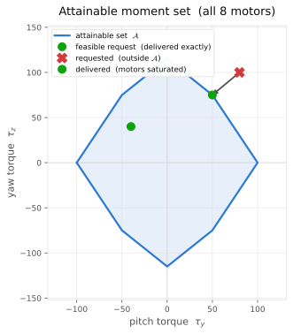
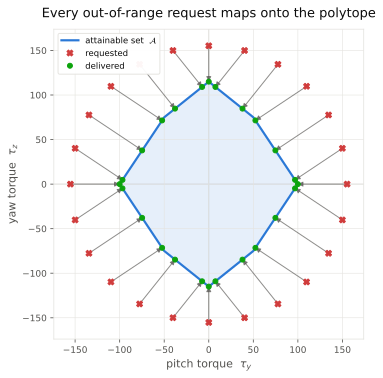
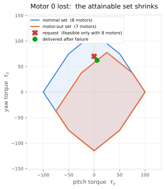

<!-- This file is auto-generated by gen_readme.py -->
# Control Allocation Third Approach


Approaches one and two both allocate as if the motors could spin arbitrarily
fast. They solve an unconstrained problem and only clamp the final square root so
a caller never receives an imaginary speed. That clamp hides the moment when a
motor would have to exceed its physical limit, and it silently distorts the
commanded torque.

Approach three keeps the exact same command interface -- pitch torque, yaw
torque and total thrust -- but makes the per-motor **saturation limits** part of
the problem. The set of commands the motors can actually deliver is a **polytope**,
and allocation becomes a small **quadratic program (QP)** that projects the
desired command onto that polytope. A request inside the polytope is delivered
exactly; a request outside it is met by the closest command the motors can
produce.

## Building blocks

Each motor uses the same quadratic propeller model as the earlier approaches, so
we allocate in squared-speed space ``s_i = n_i^2``.
```math
F_{i} = C n_{i}^{2}
```
Torque comes from the same SymPy cross product the generated simulator uses, so the documentation and the flight code never disagree.
```math
\tau_{i} = \left[\begin{matrix}0\\f_{i} r_{z_i}\\- f_{i} r_{y_i}\end{matrix}\right]
```
Stacking pitch torque, yaw torque and thrust over all motors gives the linear allocation map. Working in squared-speed space keeps it exactly linear, so the command vector is a matrix product.
```math
u = A s
```
With the current shared geometry the allocation matrix is:
```math
A = \left[\begin{matrix}-1 & -1 & -1 & -1 & 1 & 1 & 1 & 1\\1.5 & 0.8 & -1.5 & -0.8 & 1.5 & 0.8 & -1.5 & -0.8\\1 & 1 & 1 & 1 & 1 & 1 & 1 & 1\end{matrix}\right]
```

## Saturation makes the problem a polytope

A real motor cannot spin backwards and cannot exceed its top speed, so every
squared speed is boxed:
```math
0 \le s_i \le s_{\max}, \qquad s_{\max} = 25
```
That box is a set in 8-D squared-speed space. Its image under the allocation matrix is the set of every command the motors can actually produce -- the **attainable command set**. Because a linear image of a box is a zonotope, this set is a bounded convex polytope:
```math
\mathcal{A} = \{\, A\,s \;:\; 0 \le s \le s_{\max} \,\} \subset \mathbb{R}^3
```
Projected onto the pitch/yaw torque plane it is the polygon below (its boundary is traced by the motors sitting on their limits). The vertices are computed by `approachthree.model.attainable_moment_set`, the same code the allocator trusts:
```math
\left[\begin{matrix}-100.0 & 0.0\\-50.0 & -75.0\\0.0 & -115.0\\50.0 & -75.0\\100.0 & 0.0\\50.0 & 75.0\\0.0 & 115.0\\-50.0 & 75.0\end{matrix}\right]
```



The green request sits inside the polytope and is delivered exactly. The red request lies outside it -- no combination of motor speeds can produce that much torque -- so the allocator delivers the nearest point on the boundary instead, with several motors driven to saturation.

## Allocation is a quadratic program

Rather than invert the allocation matrix and hope the answer is feasible, the
allocator solves for the squared speeds directly as a bound-constrained
least-squares problem: get as close to the commanded ``u`` as possible while
staying inside the box.
```math
\begin{aligned}\min_{s}\ & \tfrac{1}{2}\,\lVert A s - u \rVert_W^{2} + \tfrac{\lambda}{2}\,\lVert s \rVert^{2} \\\text{s.t.}\ & 0 \le s \le s_{\max}\end{aligned}
```
The weight matrix $W$ prioritises attitude over thrust and the effort weight $\lambda$ is `1e-06` -- the same role approach two's damping plays, keeping the solution unique and the problem strictly convex.
```math
W = \left[\begin{matrix}10 & 0 & 0\\0 & 10 & 0\\0 & 0 & 1\end{matrix}\right]
```
Expanding the norms turns this into a standard convex QP with a positive definite Hessian, whose optimum is the projection of $u$ onto the polytope $\mathcal{A}$:
```math
\min_{s}\ \tfrac{1}{2}\, s^{\top} H s + c^{\top} s \quad\text{s.t.}\ 0 \le s \le s_{\max}, \qquad H = A^{\top} W A + \lambda I,\ \ c = -A^{\top} W u
```

## Solving the QP ourselves

In the spirit of approach two assembling its own pseudoinverse, we do not call a
QP library. The optimum is found with a primal **active-set** iteration: motors
that want to leave the feasible box are pinned to a bound, the remaining free
motors are driven to the equality-constrained minimum, and a bound is released
only when its KKT multiplier proves the cost can still fall. Because the QP is
strictly convex, the KKT conditions are sufficient, so this fixed point is the
global optimum.
```math
(Hs+c)_i = 0\ \text{(free)},\quad(Hs+c)_i \ge 0\ \text{(at } 0),\quad(Hs+c)_i \le 0\ \text{(at } s_{\max})
```
```python
s = allocated_squared_speeds(u, motors_active)   # active-set QP, box-constrained
w = allocated_motor_speeds(u, motors_active)      # = sqrt(s), always real & feasible
```

## Handling motor saturation

The table below runs a sweep of commands through the allocator. Feasible
commands are delivered exactly; once a command leaves the polytope the allocator
holds the prioritised axes and reports exactly how many motors are pinned to a
limit -- there is no silent clipping.

| command | requested $(\tau_y, \tau_z, T)$ | delivered | motors on a limit | status |
| --- | --- | --- | --- | --- |
| hover | (0, 0, 100) | (0.0, 0.0, 100.0) | 0 / 8 | yes |
| feasible maneuver | (-40, 40, 100) | (-40.0, 40.0, 100.0) | 0 / 8 | yes |
| aggressive yaw | (0, 150, 100) | (0.0, 115.0, 100.0) | 8 / 8 | **saturated** |
| combined, over-range | (80, 100, 100) | (50.0, 75.0, 100.0) | 8 / 8 | **saturated** |

For the over-range combined command the QP still returns a fully feasible squared-speed vector -- some motors floored at zero, others pinned at ``s_max`` -- rather than an infeasible one:
```math
\left[\begin{matrix}25.0\\0.0\\0.0\\0.0\\25.0\\25.0\\0.0\\25.0\end{matrix}\right]
```
The projection is not special to one direction. Every over-range request maps onto the polytope boundary:




## Motor-out example

Losing a motor removes its column from the allocation matrix, which shrinks the
attainable polytope. A command that was comfortably feasible with eight motors
can fall outside the degraded set, and the same QP handles it without any
special-casing -- it simply projects onto the smaller polytope.
The motor-out allocation matrix (motor 0 disabled) is:
```math
A = \left[\begin{matrix}0 & -1 & -1 & -1 & 1 & 1 & 1 & 1\\0 & 0.8 & -1.5 & -0.8 & 1.5 & 0.8 & -1.5 & -0.8\\0 & 1 & 1 & 1 & 1 & 1 & 1 & 1\end{matrix}\right]
```
and the attainable moment polygon collapses to:
```math
\left[\begin{matrix}-75.0 & -37.5\\-50.0 & -75.0\\0.0 & -115.0\\50.0 & -75.0\\100.0 & 0.0\\75.0 & 37.5\\25.0 & 77.5\\-25.0 & 37.5\end{matrix}\right]
```



With all eight motors the command ``(0, 70, 100)`` is delivered exactly. After motor 0 fails it lies outside the degraded polytope, so the allocator delivers the closest feasible command ``(5.75, 62.1, 94.25)`` with the surviving seven motors and reports ``7`` of ``8`` motors on a limit.
